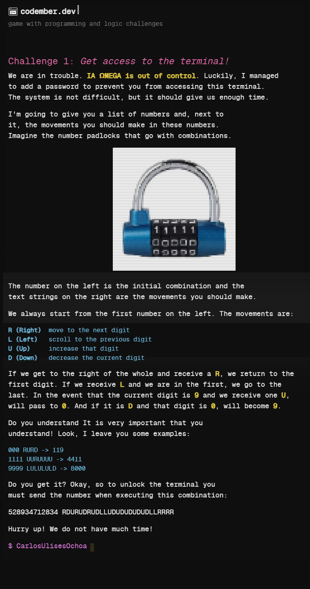

# Codember 2024

My solutions for the [Codember Coding Challenges](https://www.codember.dev) By [midudev](https://github.com/midudev) at [codember.dev](https://www.codember.dev)

<br/>

## Challenge #1



```bash
$ CarlosUlisesOchoa | ************
```

[Solution](./src/challenge-01.ts)

## Challenge #2: Detecting unwanted access


```bash
submit <valid_count>true<invalid_count>false
```

For example, if there are 10 valid attempts and 5 invalid attempts, send:

```bash
submit 10true5false
```

[Solution](./src/challenge-02/challenge-02.ts)

## How to run tests 🏃‍♂️‍➡️

```
npm i
npm run test
npm run test-<number_of_challenge>
```

**NOTE: number_of_challenge ranges from 01 to ??**. e.g. `npm run test-01`

## About developer

Visit my web [Carlos Ochoa](https://carlos8a.com)

<br/>

---

**Note:** If you encounter any issues with the project, please report them [here](https://github.com/CarlosUlisesOchoa/Codember-Challenges-2024/issues). Contributions are welcome!
